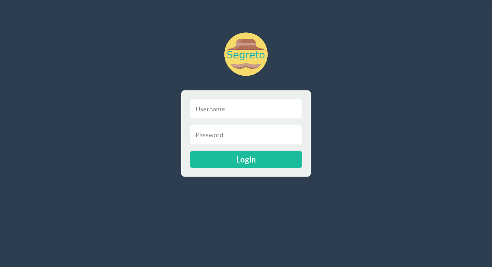

# Segreto 3 
A simple app for saving your ideas/ personal data secretely on your computer. It uses AES256 encryption to save your idea file locally, making it virtually impossible for any one to read your ideas/personal data, unless it's you or others know your password.

Flat theme inspired by [Flat UI](http://designmodo.github.io/Flat-UI/)




##Requirements

- [Python 3](https://www.python.org/)


##Setup

###1. Download

- _Download_ the zip archive [here](https://github.com/anselm94/segreto-3/archive/master.zip)

- _Unzip_ the archive

###2. Install requirements
```bash
pip3 install -r requirements.txt
```

##Usage

###1. Create users

- _Open_ `settings.ini` file in the folder using your favourite text editor

- _Create_ a user entry by editing this template
```
[User<number>]
username: <User name>
file: <Path to save your secret file>
```
- _Save_ `settings.ini` file

#####Note

- More than one user can be created in the `settings.ini` file

###2. Run

- Run `Segreto 3` app
```bash
python3 main.py
```

###3. Setup password

- Type your user name in the login screen

- Type your password in the login screen

#####Note

- Password will be setup and the encrypted secret file will be created, at the time of your first login.

###4. Create/delete entries

- Create a new entry by clicking `+` button at top-left corner

- Delete an entry by clicking the `x` button

- Modify an entry by clicking the `🖊` button

###5. Quit

- Close the app by clicking `Quit` button

#####Warning

- Always make sure you quit the app by clicking the `Quit` button at the top-right corner, else your entries will not get encrypted and saved!

#####Note

- _Login_ and _Logout_ will take some time. Explanation [here](https://github.com/andrewcooke/simple-crypt#speed), given by the [`simplecrypt`](https://pypi.python.org/pypi/simple-crypt) project, which this app uses for encryption/decryption purposes

###6. Resetting password

- Use `password_reset.py` for resetting your password
```bash
python3 password_reset.py
```
- Enter your username, the old password and new password. That's it! Password is reset!

##Built with

- Python 3
- Pythonic libraries
    - [Kivy](http://kivy.org/)
    - [simplecrypto](https://github.com/andrewcooke/simple-crypt)
    - [jsonpickle](http://jsonpickle.github.io/)

##Author

- [Merbin J Anselm](https://github.com/anselm94)

##License
```
MIT License

Copyright (c) 2016 Merbin J Anselm

Permission is hereby granted, free of charge, to any person obtaining a copy
of this software and associated documentation files (the "Software"), to deal
in the Software without restriction, including without limitation the rights
to use, copy, modify, merge, publish, distribute, sublicense, and/or sell
copies of the Software, and to permit persons to whom the Software is
furnished to do so, subject to the following conditions:

The above copyright notice and this permission notice shall be included in all
copies or substantial portions of the Software.

THE SOFTWARE IS PROVIDED "AS IS", WITHOUT WARRANTY OF ANY KIND, EXPRESS OR
IMPLIED, INCLUDING BUT NOT LIMITED TO THE WARRANTIES OF MERCHANTABILITY,
FITNESS FOR A PARTICULAR PURPOSE AND NONINFRINGEMENT. IN NO EVENT SHALL THE
AUTHORS OR COPYRIGHT HOLDERS BE LIABLE FOR ANY CLAIM, DAMAGES OR OTHER
LIABILITY, WHETHER IN AN ACTION OF CONTRACT, TORT OR OTHERWISE, ARISING FROM,
OUT OF OR IN CONNECTION WITH THE SOFTWARE OR THE USE OR OTHER DEALINGS IN THE
SOFTWARE.
```
